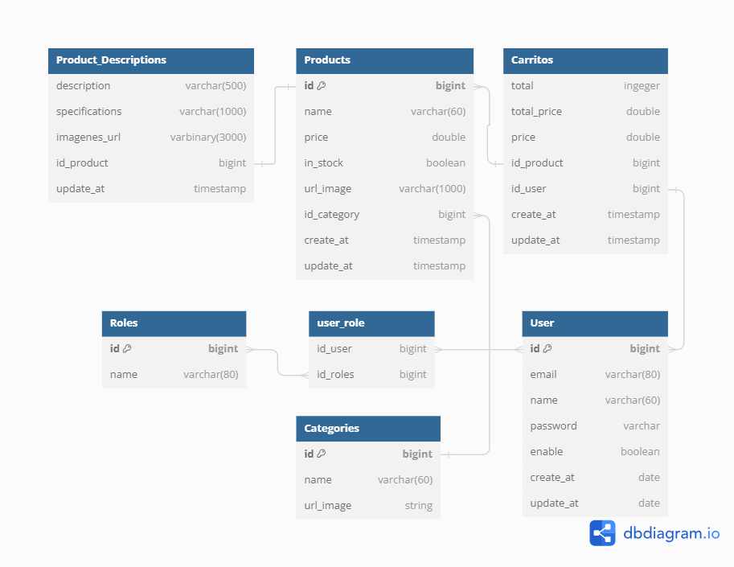

# Servicio

En esta sección se encuentran los archivos y codigo para el funcionamiento del servidor de la aplicación

## Tecnologías

- **Lenguaje:**  Java
- **Framework:** Spring boot, Spring Security, Spring Data JPA, Postgres Driver, MySql Driver
- **Base de datos:** Posgresql, MySql
- **Entorno**: Openjdk 21
- **Herramientas:** Docker compose
- **Producción:** [Render.com](https://render.com/ "Render.com")

## Datos y relaciones

